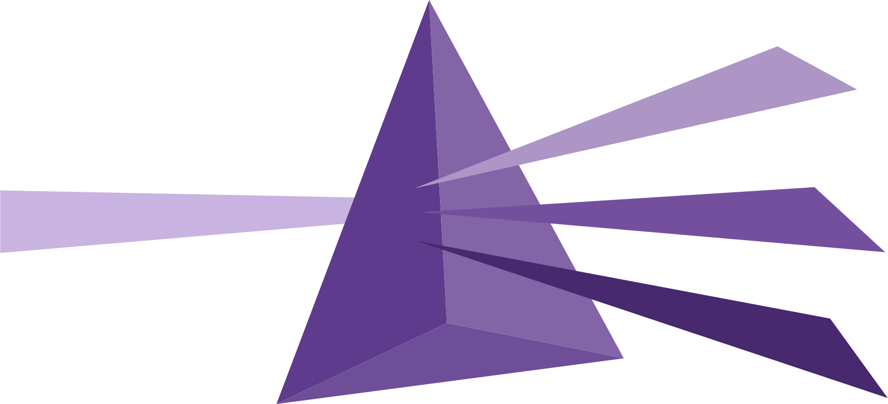

<!-- hongdown-disable-next-line -->

Optique: Type-safe combinatorial CLI parser for TypeScript
==========================================================

[![JSR][JSR badge]][JSR]
[![npm][npm badge]][npm]
[![GitHub Actions][GitHub Actions badge]][GitHub Actions]

Type-safe combinatorial CLI parser for TypeScript inspired by Haskell's
[optparse-applicative] and TypeScript's [Zod]. Build composable parsers for
command-line interfaces with full type safety, automatic type inference, and
built-in shell completion support for Bash, zsh, fish, PowerShell, and Nushell.

> [!NOTE]
> Optique is a parsing library that focuses on extracting and validating
> command-line arguments. It doesn't dictate your application's structure,
> handle command execution, or provide scaffolding—it simply transforms
> command-line input into well-typed data structures.

[JSR badge]: https://jsr.io/badges/@optique/core
[JSR]: https://jsr.io/@optique
[npm badge]: https://img.shields.io/npm/v/@optique/core?logo=npm
[npm]: https://www.npmjs.com/package/@optique/core
[GitHub Actions badge]: https://github.com/dahlia/optique/actions/workflows/main.yaml/badge.svg
[GitHub Actions]: https://github.com/dahlia/optique/actions/workflows/main.yaml
[optparse-applicative]: https://github.com/pcapriotti/optparse-applicative
[Zod]: https://zod.dev/

Features
--------

 -  *Parser combinators*: `object()`, `or()`, `merge()`, `optional()`,
    `multiple()`, `map()`, `conditional()`, `passThrough()`, and more
    for composable CLI parsing
 -  *Full type safety*: Automatic TypeScript type inference for all parser
    compositions with compile-time validation
 -  *Rich value parsers*: Built-in parsers for strings, numbers, URLs, locales,
    UUIDs, networking types (`port()`, `ipv4()`, `hostname()`, `email()`, etc.),
    Temporal types (via *@optique/temporal*), Zod schemas (via *@optique/zod*),
    and Valibot schemas (via *@optique/valibot*)
 -  *Config file support*: Load config from files with Standard Schema validation
    (via *@optique/config*), supporting Zod, Valibot, ArkType, and more
 -  *Environment variable support*: Bind options to environment variables
    with type-safe parsing and fallback behavior (via *@optique/env*)
 -  *Inter-option dependencies*: Options whose valid values depend on other
    options, with dynamic validation and context-aware shell completion
 -  *Async parser support*: Type-safe sync/async mode distinction for parsers
    that validate against external sources like git refs or remote APIs
 -  *Man page generation*: Generate Unix man pages directly from parser
    definitions (via *@optique/man*), keeping documentation always in sync
 -  *Shell completion*: Automatic completion script generation for Bash, zsh,
    fish, PowerShell, and Nushell
 -  *Smart error messages*: “Did you mean?” suggestions for typos with
    context-aware error formatting
 -  *Automatic help generation*: Beautiful help text with usage formatting,
    labeled sections, and colored output
 -  *Multi-runtime support*: Works seamlessly with Deno, Node.js, and Bun
 -  *CLI integration*: Complete CLI setup with `run()` function including help,
    version, and completion support

Quick example
-------------

~~~~ typescript
import { object, option, optional, or, merge, constant } from "@optique/core/parser";
import { string, integer } from "@optique/core/valueparser";
import { run, print } from "@optique/run";

// Reusable parser components
const commonOptions = object({
  verbose: option("-v", "--verbose"),
  config: optional(option("-c", "--config", string())),
});

// Mutually exclusive deployment strategies
const localDeploy = object({
  mode: constant("local" as const),
  path: option("--path", string()),
  port: option("--port", integer({ min: 1000 })),
});

const cloudDeploy = object({
  mode: constant("cloud" as const),
  provider: option("--provider", string()),
  region: option("--region", string()),
  apiKey: option("--api-key", string()),
});

// Compose parsers with type-safe constraints
const parser = merge(
  commonOptions,
  or(localDeploy, cloudDeploy)
);

const config = run(parser, { help: "both" });
// config: {
//   readonly verbose: boolean;
//   readonly config: string | undefined;
// } & (
//   | {
//       readonly mode: "local";
//       readonly path: string;
//       readonly port: number;
//   }
//   | {
//       readonly mode: "cloud";
//       readonly provider: string;
//       readonly region: string;
//       readonly apiKey: string;
//   }
// )

// TypeScript knows exactly what's available based on the mode
if (config.mode === "local") {
  print(`Deploying to ${config.path} on port ${config.port}.`);
} else {
  print(`Deploying to ${config.provider} in ${config.region}.`);
}
~~~~

Docs
----

Optique provides comprehensive documentation to help you get started quickly:
<https://optique.dev/>.

 -  [Why Optique?] — What makes Optique different from other CLI libraries
 -  [Tutorial] — Step-by-step guide from simple options to nested subcommands
 -  [Cookbook] — Practical recipes for common CLI patterns including shell
    completion

API reference documentation for each package is available on JSR (see below).

[Why Optique?]: https://optique.dev/why
[Tutorial]: https://optique.dev/tutorial
[Cookbook]: https://optique.dev/cookbook

Packages
--------

Optique is a monorepo which contains multiple packages.  The main package is
*@optique/core*, which provides the shared types and parser combinators.
The following is a list of the available packages:

| Package                                  | JSR                          | npm                          | Description                                 |
| ---------------------------------------- | ---------------------------- | ---------------------------- | ------------------------------------------- |
| [@optique/core](/packages/core/)         | [JSR][jsr:@optique/core]     | [npm][npm:@optique/core]     | Shared types and parser combinators         |
| [@optique/run](/packages/run/)           | [JSR][jsr:@optique/run]      | [npm][npm:@optique/run]      | Runner for Node.js/Deno/Bun                 |
| [@optique/config](/packages/config/)     | [JSR][jsr:@optique/config]   | [npm][npm:@optique/config]   | Config file support with [Standard Schema]  |
| [@optique/env](/packages/env/)           | [JSR][jsr:@optique/env]      | [npm][npm:@optique/env]      | Environment variable integration            |
| [@optique/git](/packages/git/)           | [JSR][jsr:@optique/git]      | [npm][npm:@optique/git]      | Git reference parsers (branches, tags, etc) |
| [@optique/logtape](/packages/logtape/)   | [JSR][jsr:@optique/logtape]  | [npm][npm:@optique/logtape]  | [LogTape] logging integration               |
| [@optique/man](/packages/man/)           | [JSR][jsr:@optique/man]      | [npm][npm:@optique/man]      | Man page generation from parsers            |
| [@optique/temporal](/packages/temporal/) | [JSR][jsr:@optique/temporal] | [npm][npm:@optique/temporal] | [Temporal] value parsers (date and time)    |
| [@optique/valibot](/packages/valibot/)   | [JSR][jsr:@optique/valibot]  | [npm][npm:@optique/valibot]  | [Valibot] schema integration for validation |
| [@optique/zod](/packages/zod/)           | [JSR][jsr:@optique/zod]      | [npm][npm:@optique/zod]      | [Zod] schema integration for validation     |

[jsr:@optique/core]: https://jsr.io/@optique/core
[npm:@optique/core]: https://www.npmjs.com/package/@optique/core
[jsr:@optique/run]: https://jsr.io/@optique/run
[npm:@optique/run]: https://www.npmjs.com/package/@optique/run
[jsr:@optique/config]: https://jsr.io/@optique/config
[npm:@optique/config]: https://www.npmjs.com/package/@optique/config
[Standard Schema]: https://standardschema.dev/
[jsr:@optique/env]: https://jsr.io/@optique/env
[npm:@optique/env]: https://www.npmjs.com/package/@optique/env
[jsr:@optique/git]: https://jsr.io/@optique/git
[npm:@optique/git]: https://www.npmjs.com/package/@optique/git
[jsr:@optique/logtape]: https://jsr.io/@optique/logtape
[npm:@optique/logtape]: https://www.npmjs.com/package/@optique/logtape
[LogTape]: https://logtape.org/
[jsr:@optique/man]: https://jsr.io/@optique/man
[npm:@optique/man]: https://www.npmjs.com/package/@optique/man
[jsr:@optique/temporal]: https://jsr.io/@optique/temporal
[npm:@optique/temporal]: https://www.npmjs.com/package/@optique/temporal
[Temporal]: https://developer.mozilla.org/en-US/docs/Web/JavaScript/Reference/Global_Objects/Temporal
[jsr:@optique/valibot]: https://jsr.io/@optique/valibot
[npm:@optique/valibot]: https://www.npmjs.com/package/@optique/valibot
[Valibot]: https://valibot.dev/
[jsr:@optique/zod]: https://jsr.io/@optique/zod
[npm:@optique/zod]: https://www.npmjs.com/package/@optique/zod
